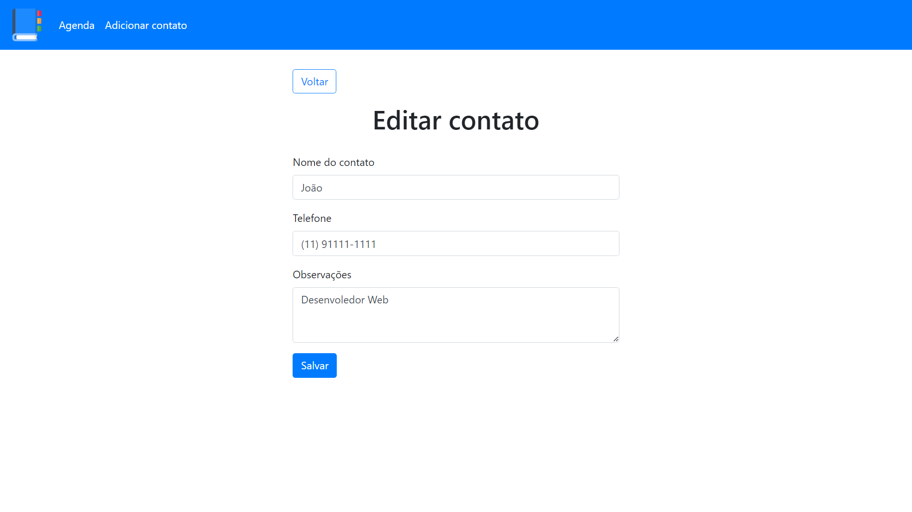

# Agenda PHP
> Agenda de contatos simples construído em PHP para treinar meus conhecimentos iniciais na linguagem.

Este projeto consiste na criação de uma agenda de contatos em PHP e MySQL usando PDO, desenvolvido como parte de um curso da Udemy sobre PHP, com o objetivo de aprimorar e aplicar os conhecimentos adquiridos durante o curso. A agenda será construída utilizando os conceitos e técnicas aprendidos, oferecendo uma oportunidade prática para explorar a linguagem PHP e suas conexões com o banco de dados MySQL por meio do PDO e da prática de prepared statements, na criação de um sistema dinâmico e funcional.

Este projeto será uma extensão do aprendizado teórico que venho publicando em <https://github.com/katiri/PHP>, permitindo a implementação de funcionalidades reais em um ambiente controlado e focado no desenvolvimento de habilidades em PHP.

## Telas

## Observações
Para além do PHP o projeto também aborda um pouco sobre estrutura HTML, CSS, responsividade, MySQL, PDO e prepared statements.

## Meta
João Pedro Pazos Ramos - <jpedropazosramos@email.com>

<https://github.com/katiri/AgendaPHP>